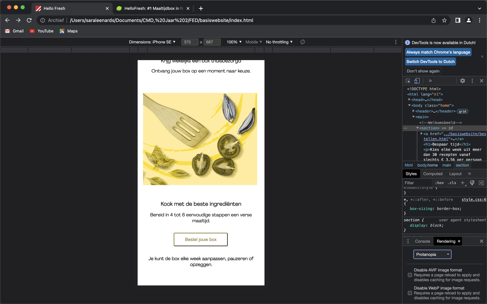

# Procesverslag
Markdown is een simpele manier om HTML te schrijven.  
Markdown cheat cheet: [Hulp bij het schrijven van Markdown](https://github.com/adam-p/markdown-here/wiki/Markdown-Cheatsheet).

Nb. De standaardstructuur en de spartaanse opmaak van de README.md zijn helemaal prima. Het gaat om de inhoud van je procesverslag. Besteedt de tijd voor pracht en praal aan je website.

Nb. Door *open* toe te voegen aan een *details* element kun je deze standaard open zetten. Fijn om dat steeds voor de relevante stuk(ken) te doen.

## Jij

  
uitwerken voor kick-off werkgroep

  ### Auteur:
  Sara Leenards

  #### Je startniveau:
  Blauwe piste

  #### Je focus:
  Bling bling, Surface Plane
 

## Je website

  
Uitwerken voor kick-off werkgroep

Kick-Off Werkgroep, Dinsdag 6 september

Vandaag hebben wij een introductie gehad over het vak Frontend Development. Hierbij hebben wij eerst naar twee sprekers geluisterd. Namelijk naar denker/maker, Astrid Poot en naar Maaike Klip. Dit was erg interessant om naar te luisteren omdat zij het hebben gehad over projecten van hun. Ze vertelden waarom zij juist hiermee aan de slag waren gegaan en hoe hierop gereageerd werd.

Vervolgens hebben wij een introductie gevolgd over "Jaar 2" op CMD. Hierbij kregen wij van alles te horen over de vakken. Zo werd FED ingeleid door ons te vertellen wat ons te wachten staat en wat wij uiteindelijk zullen gaan opleveren. We zullen aan de slag gaat met het namaken van een website door middel van CSS. 

In de les zelf hebben wij van onze docent zelf, Vasilis van Gemert nog alle overige detail inforamtie te horen gekregen. Bijvoorbeeld over CSS, een taal waar je o.a mee kan vormgeven en programmeren. Hoe je het beste een prototype uitwerkt en met welke onderdelen wij aan de slag zullen gaan de komende weken. 

  ### Je opdracht:
Ik ga de website van Hello Fresh na proberen te maken. Ik heb gemerkt in jaar 1 dat ik een persoon ben die coderen erg lastig vind. Ik heb bij het uitzoeken van een website gekeken naar het gebruik van de oppervlakte. Zo heb ik bijvoorbeeld gekeken naar waar bepaalde vakken zijn geplaatst, waar buttons staan en waar de h1, h2 enzovoorts staan. Ik ga de aankomende 4 lesweken elke week minimaal 20 uur werken om de website van Hello Fresh te realiseren welke toegankelijk, responsive op gekozen formaat & een proffesionele uitstraling is/heeft. 
https://www.hellofresh.nl/

Ik ga werken aan 2 verschillende pagina's en daarbij ga ik mijn procesverslag bijhouden. 

De komende weken gaan we aan de slag met de volgende onderdelen:
• Typografie
• Flexbox
• Grid
• Positioneren
• JS 3-stap
• Animeren
• States (buttons, etc)
• Toegankelijkheid

Deze onderwerpen gaan we eerst bestuderen door het maken van oefeningen. Mijn startpunt is dus de blauwe piste, omdat zoals ik al zei, ik CSS en HTML lastig vind. 

Toegankelijkheid zullen we de komende weken testen door 2 testen uit te voeren. 

  #### Screenshot(s) van de eerste pagina (small screen): 
  Page 1   Home Page  
  			
  #### Screenshot(s) van de tweede pagina (small screen):
  Page 2   Hoe zit het? 
  			 

## Toegankelijkheidstest 1/2 (week 1)

  
uitwerken na test in 1e werkgroep

  ### Bevindingen
  Lijst met je bevindingen die in de test naar voren kwamen:
  • Spasme: 
    Besturen is lastig.

  • Motorisch: 
    Het gebruik van knoppen is niet gemakkelijk. 
    (Elastiekjes) precies dingen uitklikken werkt niet. 
    Scrollen is lastig.
    Knoppen moeten groter om makkelijk te kunnen gebruiken. 
    Goed kijken naar gebruik van shortcuts.

  • Visueel (brillen): 
    Kleuren zijn van belang, contrast is van belang en het gebruik van ruimte kan veel veranderen. 
    Weinig overzicht
    Goed moeten focussen
  
  • Parkinson: 
    Zwaar
    Kleine handelingen zijn lastig
    Trillingen
    Niet gericht iets kunnen doen. 

  • Concentratie (ballon hooghouden):
    Lastig
    Je bent met teveel tegelijk bezig.
    Je hebt de neiging veel over te slaan.

  #### Screenreader
Tijdens de toegankelijkheid testen van de HelloFresh site zelf kwam ik er al snel achter dat de screenreader dit niet goed kan lezen. De H's zijn niet goed verdeeld en ook de andere elementen worden op een niet logische en onoverzichtelijke manier voorgelezen of zelfs overgeslagen. Ik ga mijn best doen om de toegankelijkheid hiervan beter te maken. 

  #### Muis en Toetsenbord 
Het besturen/doorlopen van de site door middel van de muis en/of het toetsenbord was lastig. De muis blijft vaak hangen en je moet écht op een element klikken wil je weer weg van het voorgaande element. 

  #### Motoriek (shocks, elastiekjes)
Knoppen waren redelijk goed aan te klikken maar ze zouden wel groter mogen om het nog sterker te maken. 

  #### Visueel (brillen, contrast, kleurenblind, dark/light). 
Kleurencontrast was duidelijk, er wordt al goed gebruik gemaakt voor het kleurcontrast en veel witruimtes. 

Wat kan in het algemeen dus beter:
• Groteren letters kunnen vaak al helpen.
• Witruimtes tussen tekst en afbeelingen kunnen helpen.
• Kleurgebruik op de juiste manier toepassen is van belang.
• Grotere knoppen
• De focus leggen op de punten waar je je bevindt. 
• Overzichtelijke vormgeving
• Rust uitstralen
• Niet té lastige shortcuys maken
• Stapsgewijs door de site heen kunnen werken.

Kopjes & sections:
1. Structuur elementen: header, main, footer, nav, sections, article, aside, h1-h6, adress, details & summary.

Header: logo, nav etc.
Main: hoofdcontent, belangrijkste elementen.
Footer: Meta data, mail, tijden, FAQ etc.
Details: uitklapmenu, summary

2. Text
H1-H6, p. blockquote, figure, figcaption etc.
Structuur is voor mens en (zoek)machine.

=> Secties: header, main, footer, nav, section, article & aside. 

=> Kopjes: H1-H6 etc.

H1 is waarvoor je komt. 
H2 is voor hoofdonderdelen van de pagina.
H3 is voor subtitels
H4 is voor metadata

3. Content
Afbeeldingen, buttons, labels en linkjes. 

## Breakdownschets (week 1)

  
uitwerken na afloop 2e werkgroep

Ik deze les ben ik aan de slag gegaan met het bepalen van m'n pagina's en de content die ik wil gaan uitwerken. Door het maken van een screenshots en de delen weg te knippen die onnodig zijn ga ik een breakdownschets maken. Ik ga op basis van de screenshots bepalen welke selectoren waar bij horen en wat de structuur zal gaan worden.
  ### de hele pagina: 
  			

  ### dynamisch deel (bijv menu): 
  			

  ### wellicht nog een dynamisch deel (bijv filter): 
  			

## Voortgang 1 (week 2)

  
uitwerken voor 1e voortgang

  ### Stand van zaken
Het volgen van de lessen, de theorie bestuderen ging de afgelopen periode goed. Ik merkte dat ik als eerste duidelijkheid wilde hebben over hetgeen waar in de lessen over gesproken werd. Ik wilde dus eerst écht bijlopen met alles wat betreft de opdrachten. Ik merkte wel dat ik de verhouding van opdrachten ten opzichte van hetgeen wat we in de les zouden moeten doen veel vind. Ik had gehoopt, in de les zelf ook tijd te hebben om aan het werk te gaan met de site maar hier merk ik echter te weinig tijd voor te hebben. 

  ### Agenda voor meeting
  Samen met je groepje opstellen

  | Stephan: 
    CSS bestand netjes vormgeven 
  
  | Lars:
  CSS bestand netjes vormgeven

  | Donna:
  Afwezig

  | Sara:
  Doorlopen proces, bespreken van prioriteiten en voortgang voor de komende weken.
 

  ### Verslag van meeting
  hier na afloop snel de uitkomsten van de meeting vastleggen

  - Website ziet er prima uit voor het eerste voortgangsgesprek
  - Pagina 1 met content staat
  - Verder nu gaan werken aan de CSS en dus het stylen van de pagina. 

## Voortgang 2 (week 3)

  
uitwerken voor 2e voortgang

  ### Stand van zaken
Het stylen van mijn website ging beter dan ik had verwacht na het maken van de breakdownschets. Ik merkte wel dat ik de afgelopen week weer moest inkomen met wanneer je gebruik maakt van welke selectoren en waardes daarbij. Het is mij wel gelukt om bijna heel pagina 1 in elkaar te zetten. Er waren wel nog wat dingen als sliders van foto's die ik lastig vond en waar ik nog het een en ander over wilde vragen. 

  ### Agenda voor meeting
  Samen met je groepje opstellen

  | Stephan: 
Controleren site

  | Lars:
Afwezig

  | Donna:
Site doorlopen, slider van list items. 

  | Sara:
Hamburgermenu, buttons naast slider foto's, is alles semantisch correct etc? 

  ### Verslag van meeting
Hetgeen waar ik mee aan de slag ga is het volgende:
• Hamburgermenu: details > summary > li
• H1 = HelloFresh = Visibility:Hidden
• Buttons naast slider foto: slider maken van meerdere foto's
• Semantisch correct => H2 en H3's beter verdelen. 
• Strong werkt niet
• Linkjes stylen als buttons ipv buttons al in html zetten.

## Toegankelijkheidstest 2/2 (week 4)

  
uitwerken na test in 8e werkgroep

## Eigen site testen:
• screenreader
• muis/toetsenbord en kleurtjes
• diverse beperkingen

## Screenreader
• Afbeeldingen moet ik nog beter beschrijven, ik heb nu nog bij "alt" staan "foto1" maar dit beschrijft de foto slecht. 
• Linkjes zijn allemaal bezocht volgens de screenreader.
• De focusstate is oranje dus valt nog wel redelijk op. 

## Feedback van Vera:
• Logo een naam geven in de alt tekst. 
• Duidelijk maken welk stukje tekst bij welke afbeelding hoort.
• Bij de echte site gaat de screenreader door het hamburgermenu maar je ziet niks.
• De knoppen. linkjes en forms werken met de tab.
• Er is een redelijke goede volgorde van selectoren. 

## Kleuren
• Blur effect werkt redelijk goed. Je zie een duidelijk contrast tussen kleuren en witruimte wat zorgt voor duidelijkheid. 
• Darkmode werkt goed.

## Diverse beperkingen
• Slechte motoriek: grote buttons die makkelijk in gebruik zijn. Swipen door de site is lastiger maar dat is een kwestie van tijd. 

• Spasme/parkinson: sliders mogen groter, knoppen werken goed. Er i veel witruimte wat voor duidelijkheid zorgt. 

## Voortgang 3 (week 4)

  
uitwerken voor 3e voortgang

  ### Stand van zaken
Ik ben blij met het resultaat wat nu staat. Vooral m'n eerste pagina vind ik erg sterk. Ik heb hier veel tijd aan besteed en ben blij met het restultaat. Er zijn nog wat kleine dingen die ik door wil gaan nemen met de student-assistenten. 

  ### Agenda voor meeting
  Samen met je groepje opstellen

  | Stephan: 
Doorwerken

  | Lars:
GitHub fixen

  | Donna:
GitHub fixen en verder werken met de student-assistent

  | Sara:
Tekstslider op de eerste pagina fixen. Kijken of ik de tekst ook kan aanpassen zodat hij om de zoveel seconde naar een ander woord veranderd. 

  ### Verslag van meeting
  hier na afloop snel de uitkomsten van de meeting vastleggen

  - Punt is verwerkt
  - Aan de slag met Surface Plane
  - Alt teksten aanpakken

## Eindgesprek (week 5)

  
uitwerken voor eindgesprek

  ### Je uitkomst - karakteristiek screenshots:
  
  
  

  ### Dit ging goed/Heb ik geleerd: 
  Korte omschrijving met plaatjes:

  Ik ben sowieso trots op alles wat ik heb neergezet. Ik had een jaartje geleden nooit kunnen bedenken dat ik dit allemaal zou kunnen neerzetten. Ondanks dat ik nogsteeds veel moet leren vind ik dat ik goed m'n best heb gedaan en dat je zeker de HelloFresh site eruit kan halen. 

   
  
  

  ### Dit was lastig/Is niet gelukt:
  Korte omschrijving met plaatjes:
  Iets wat ik lastig vind is een thema toepassen met Javascript, ik heb het geprobeerd maar het lukte niet. Ik heb vervolgens wel darkmode uitgewerkt maar die werkt alleen niet op de tweede pagina en ik kan niet achterhalen waarom. Alles controleren, overzicht behouden en overbodige CSS schrijven vind ik nog wel lastig. 
  
  

## Foto's
  			
        
        
        

## Bronnenlijst

  
continu bijhouden terwijl je werkt

  Nb. Wees specifiek ('css-tricks' als bron is bijv. niet specifiek genoeg).

1. : The Details disclosure element - HTML: HyperText Markup Language | MDN. (2022, 14 september). Geraadpleegd op 5 oktober 2022, van https://developer.mozilla.org/en-US/docs/Web/HTML/Element/details
2. Jana, S. (2022, 2 juni). Automatic Image Slider using only HTML & CSS. DEV Community 👩‍💻👨‍💻. Geraadpleegd op 5 oktober 2022, van https://dev.to/shantanu_jana/automatic-image-slideshow-in-html-css-26jl
3. How to Insert Video in HTML. (z.d.). Learn HTML | W3Docs. Geraadpleegd op 5 oktober 2022, van https://www.w3docs.com/snippets/html/how-to-insert-video-in-html.html
4. Chris, K. (2022, 8 februari). HTML Video – How to Embed a Video Player with the HTML 5 Video Tag. freeCodeCamp.org. Geraadpleegd op 5 oktober 2022, van https://www.freecodecamp.org/news/html-video-how-to-embed-a-video-player-with-the-html-5-video-tag/
5. How To Toggle Between Class Names. (z.d.). Geraadpleegd op 5 oktober 2022, van https://www.w3schools.com/howto/howto_js_toggle_class.asp
6. Coyier, C. (2022, 30 september). A Complete Guide to Flexbox. CSS-Tricks. Geraadpleegd op 5 oktober 2022, van https://css-tricks.com/snippets/css/a-guide-to-flexbox/
7. Coyier, C. (2011, 20 augustus). CSS Almanac. CSS-Tricks. Geraadpleegd op 5 oktober 2022, van https://css-tricks.com/almanac/

